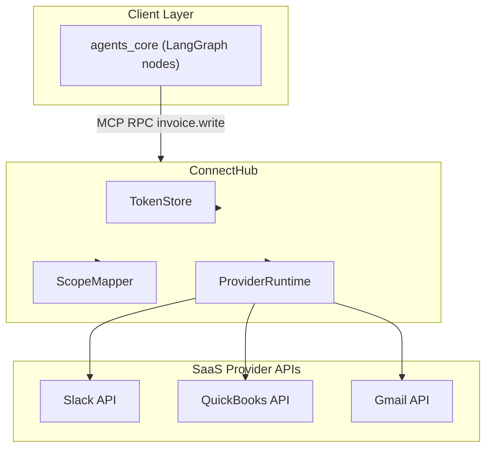

# Design Sketch — ConnectHub as an MCP Server
**Status:** Draft v0.1 · **Authors:** ChatGPT + Peter · **Last updated:** 2025-06-24

## 1 Purpose
Augment ConnectHub so it speaks the **Model-Context Protocol (MCP)**.

* Existing REST endpoints continue to work for legacy callers.
* New clients (agents_core, LangGraph nodes, third-party apps) talk MCP over HTTP/2 or WebSockets.
* Central TokenStore, ScopeMapper, and ProviderAdapters remain in-process.

---

## 2 Surface / Contract
| MCP Concept          | ConnectHub Mapping                                           |
| -------------------- | ------------------------------------------------------------ |
| `ServiceDefinition`  | One service called `clancy.connecthub`                      |
| `RPC name`           | `<provider>.<capability>` (e.g. `slack.chat.post`)          |
| `Request.arguments`  | Same JSON currently accepted on `/proxy/*`                  |
| `Request.headers`    | Forwarded HTTP headers (`Authorization`, `x-org-id`, `x-correlation-id`, …) |
| `Response.content`   | Normalised provider response JSON                           |
| `Response.stream`    | Adapter may opt-in to server-side streaming                 |
| `Metadata`           | `provider`, `latency_ms`, `rate_limit_remaining`, …         |

The capability catalogue at `GET /capabilities` is serialised as an MCP `ServiceDescription` so clients can self-discover available RPCs.

---

## 3 Authentication & Authorisation Flow
```text
Client ──► MCP Request  (HTTP/2 or WS)
          headers:
          Authorization: Bearer <Auth0 M2M JWT>
          x-org-id: 42
          x-correlation-id: abc-123
               ▼
ConnectHub
1. Verify JWT signature & expiry against Auth0 JWK set.
2. Extract `scope` claim → list of internal scopes.
3. Look up `<provider>.<capability>` ↔ internal_scope map.
4. Reject if caller lacks scope; else continue.
5. Fetch/refresh provider token from TokenStore.
6. Execute adapter → provider API.
7. Emit structured audit log & Prometheus metrics.
8. Return MCP response (stream or single payload).
```
*Provider OAuth tokens never leave ConnectHub.  If ConnectHub fans out to a micro-proxy later, it does so using mTLS + its own short-lived service JWT, **not** the provider token.*

---

## 4 Transport & Encodings
1. **Primary:** HTTP/2 with `content-type: application/mcp+json;v=1`.
2. **Alternative:** WebSocket sub-protocol `mcp.v1`.
3. **Streaming:** Uses MCP chunked messages (`data`, `event`, `error`, `done`). Fastify's `stream.pipeline` covers the server side.

---

## 5 Internal Components Added / Adjusted
* **MCP Router** (new)
  * Parses incoming MCP frames and routes to `AdapterRegistry.execute()` based on RPC name.
  * Injects auth context and org ID into Fastify request `ctx`.
* **CapabilityRegistry** (minor change)
  * Adds `toServiceDescription()` to dump MCP-compatible service metadata.
* **Adapter Interface** (optional change)
  ```ts
  type AdapterExecute = (
    args: unknown,
    ctx: ExecuteCtx
  ) => Promise<AdapterResult> | AsyncIterable<AdapterChunk>;
  ```
  Adapters that support streaming return an `AsyncIterable`.

---

## 6 Open Questions
1. **Back-pressure / flow-control** — rely on HTTP/2 windows or implement MCP credit scheme?
2. **Versioning** — bump minor when adding new capabilities, major when changing arg schema?
3. **Error taxonomy alignment** — map existing `AUTH_ERROR`, `RATE_LIMIT`, … to MCP standard codes.
4. **Observability** — decide on trace-ID propagation key (`traceparent` vs `x-trace-id`).

---

## 7 Next Steps
1. Add `@fastify/mcp` plugin stub (or internal) to parse/serialise MCP frames.
2. Generate ServiceDescription directly from the existing `capabilities` table.
3. Update CI tests to run through both REST and MCP paths.
4. Write integration test that streams a large Slack file upload via MCP.
5. Draft deprecation notice for `/proxy/*` once MCP is stable.

---

## Appendix — High-Level Component Diagram
